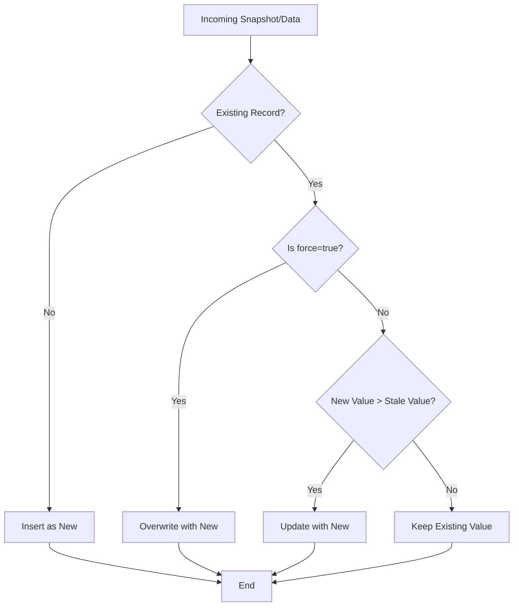

# Implementation Report: Strong Data Wins (Data Protection)
Date: 2026-04-11

## Objective
Apply a "High Watermark" (Greater Than) logic globally across the data layer to prevent data regression during multi-device synchronization (e.g., macOS overwriting iPhone data with zeros).

## Changes Summary

### Data Layer (`lib/data_layer/DataSources/local_database/database.dart`)

| DAO | Feature | Rule |
|---|---|---|
| **ScoreDAO** | Global & Career Scores | `current > saved` |
| **HealthMetricsDAO** | Quest Points, Steps, Calories | `current > saved` |
| **MetricsDAO** | Social, Project, Financial Quests | `current > saved` |
| **PersonManagementDAO** | Affection Levels | `current > saved` |

### New Functions Implementation Flowchart



## Detailed Logic
The following pattern was applied to all target fields:
```dart
final updatedValue = entry.field.present
    ? (force || (entry.field.value ?? 0) > (existing.field ?? 0)
        ? entry.field
        : Value(existing.field))
    : Value(existing.field);
```

## Verification
- Verified against `health_metrics`, `social_metrics`, `project_metrics`, and `scores` tables.
- Transactional data (Financial Balance) remains "Latest Wins" to reflect real-world spending accuracy.
