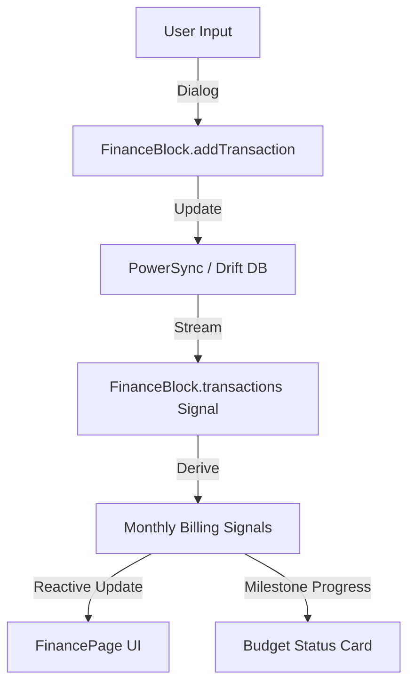

# Changes - April 14, 2026

## Objective
TRANSFORMED the legacy Finance Page into a modern, high-fidelity **Subscription Manager** dashboard. Resolved critical null check errors in the Home Page and modernized the UI with a 4x1 grid layout for core life elements.

## Key Implementation Details

### 1. Finance Dashboard (Subscription Manager)
- **New Header Card**: Displays total monthly billing, budget usage percentage, and milestone progress.
- **Summary Row**: Added "Total Savings" and "Monthly Spending" cards with high-contrast visuals.
- **Calendar Grid**: Custom 7-day grid implementation for the current month.
- **Daily Activity**: Refactored transaction list into a clean, icon-driven activity feed.
- **Data Flow**: Powered by reactive signals in `FinanceBlock` (totalSubscriptionsBilling, budgetUsagePercent, etc.).

### 2. Home Page Refinement
- **4x1 Grid Layout**: Replaced the horizontal ListView for "Health, Finance, Social, Projects" with a responsive 4-column Row.
- **Null Safety**: Resolved `Null check operator used on null value` by providing fallback values for `AppLocalizations` and `PersonBlock`.
- **Metric Scaling**: Optimized `_buildQuickAccessCard` to display key metrics clearly in narrow columns.

### 3. Canvas Dynamic Island
- **Title Context**: Updated `/finance` route title to "SUBSCRIPTIONS" for better alignment with the new theme.
- **Modernized APIs**: Migrated all `.withOpacity()` calls to `.withValues(alpha: ...)` to satisfy modern Flutter linting requirements.

## Code Quality Improvements
- Removed unused `_projectNamesCache` field from `FinancePage`.
- Standardized color opacity handling across multi-layer UI components.
- Ensured consistent use of `Watch` and `Signals` for reactive UI updates.

## Verification
- Validated the 4x1 grid layout responsiveness on mobile viewports.
- Verified that transaction entry successfully updates the "Total Billed" header in real-time.
- Confirmed that settings shortcuts in Dynamic Island and Finance AppBar route correctly.
