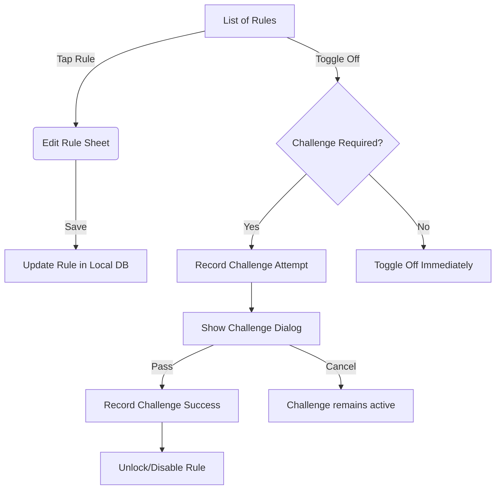

# Changes - 2026-04-16: App Blocker Enhancements

## Overview
Added the ability to edit existing app blocking rules and track "Anti-Slack" challenge performance per rule session.

## Flowchart: Challenge Lifecycle & Editing

## Key Implementations

### 1. Enhanced Data Model
- Modified `SocialBlockRule` to include `totalChallenges` and `challengesPassed`.
- Added `successRate` derived field and `copyWith` helper.

### 2. Orchestration Layer Refactor
- `SocialBlockerBlock` now supports `updateRule`.
- Split challenge tracking into `recordChallengeAttempt()` and `recordChallengeSuccess()` for accurate session statistics.

### 3. Reactive UI Updates
- Rule tiles now feature:
    - **Interactive Parallax & InkWell**: Clean, tappable interaction.
    - **Success Rate Statistics**: Color-coded chips (Green for high discipline, Red for frequent skips).
    - **Edit Mode**: `_AddRuleSheet` dynamically adapts to "Edit" or "New" states based on context.

## Files Modified
- [SocialBlockProtocol.dart](file:///Users/duylong/Code/Flutter/ice_gate/lib/data_layer/Protocol/Social/SocialBlockProtocol.dart)
- [SocialBlockerBlock.dart](file:///Users/duylong/Code/Flutter/ice_gate/lib/orchestration_layer/ReactiveBlock/User/SocialBlockerBlock.dart)
- [SocialBlockerPage.dart](file:///Users/duylong/Code/Flutter/ice_gate/lib/ui_layer/social_page/blocker/SocialBlockerPage.dart)
