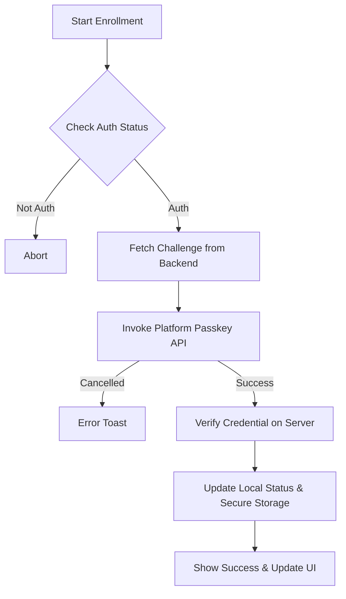

# Implementation Report: Evolutionary Auth Flow
**Date**: 2026-04-17
**Status**: 🚀 Completed

## 🎯 Objective
Implement a seamless "Identity Evolution" authentication journey, transitioning from Google OAuth to local credentials and finally to Passkeys.

## 🛠 Features Implemented

### 1. Identity Glance & Auto-Auth
- **PrismEntryPage**: Shows last user's profile during logo assembly.
- **Auto-Biometrics**: Triggers login immediately if user is recognized.
- **Gmail Fast Track**: One-tap onboarding for new users.

### 2. Identity Personalization
- **ChangePasswordPage**: Updated for Google sign-ups with "Identity Upgrade" theme.
- **PersonalInformationPage**: Added "Identity Evolution" banner for Level 1 (Google) users.
- **Routing**: Registered `/change-password` and `/change-username` as global routes to support cross-component navigation.

### 3. Security Tier Upgrade
- **PasskeyEnrollmentWidget**: Beautiful UI for registering device as a passkey.
- **AuthBlock integration**: New `enrollPasskey()` reactive logic.

## 📊 Flowchart: Passkey Enrollment process

## 📝 Key Insights & Decisions
- **Premium Aesthetics**: Used `Watch` signals for instant UI transitions (banners appearing/disappearing).
- **Security Logic**: Persisted profile metadata in secure storage to enable the "Glance" experience even before the network is ready.
- **PowerSync Stability**: Maintained sync rule integrity for `user_accounts` while exposing `password_hash` to the mobile client for logic checks.

## 📂 Files Modified
- `lib/orchestration_layer/ReactiveBlock/User/AuthBlock.dart`
- `lib/ui_layer/animation_page/prism_entry_page.dart`
- `lib/ui_layer/user_page/PersonalInformationPage.dart`
- `lib/ui_layer/user_page/ChangePasswordPage.dart`
- `lib/initial_layer/CoreLogics/SecureStorageService.dart`
- `lib/initial_layer/CoreLogics/CustomAuthService.dart`
- `lib/ui_layer/user_page/PasskeyEnrollmentWidget.dart` [NEW]
