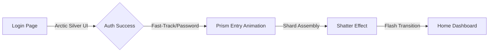

# Changes Report - 2026-04-17 (ICE Gate Entry Overhaul)

## Summary
Unified the application entry experience by transitioning `LoginPage` to an **Arctic/Ice** aesthetic (Silver, Blue, Obsidian) to match the `PrismEntryPage` animation. Refactored the monolithic entry page into modular components for improved maintainability.

## Key Insights
- **Design Unification**: Replacing the "Cyber Purple" theme with a deep Obsidian/Arctic palette creates a continuous visual narrative from initial authentication to the core app experience.
- **Modular Component Architecture**: Decoupling complex `CustomPainter` logic from the `StatefulWidget` reduces file complexity and allows for easier animation adjustments in isolation.
- **Premium UI Patterns**: Leveraging `BackdropFilter`, custom gradients, and synchronized haptic feedback significantly enhances the "First Impression" quality of the app.

## Detailed Changes
- [x] **New Components**: Created `lib/ui_layer/animation_page/components/prism_painters.dart` and `entry_constants.dart`.
- [x] **High-Intensity Refinements**:
    - **Multiple Impact Points**: Cracks now radiate from 3 distinct "strike" zones, resulting in a more natural spiderweb pattern.
    - **Intensive Shatter**: Increased particle count (650) and max velocity (4000) for a more powerful visual payoff during the transition.
    - **Glass Fidelity**: Added more frequent specular glints and sharper shard edges to the custom painters for a premium crystalline feel.

## Future Considerations
- Consider moving more "Brand" themes to `entry_constants.dart` if the user wants to support dynamic themes (e.g., Summer/Cyber).
- Extend the `SymmetricPetalPainter` to other loading states across the app for visual branding.

## Flowchart: Unified Entry Experience

