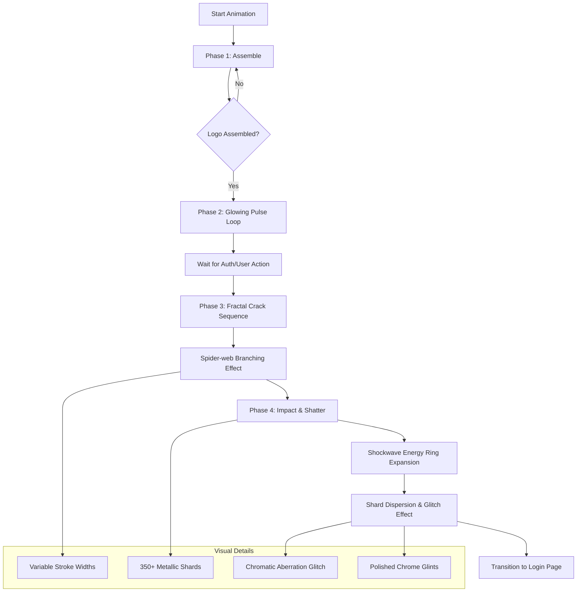

# Symmetric Petal Entry Animation Flow

This document outlines the animation sequence logic for the updated PrismEntryPage, featuring the 4-petal mandala logo and the cinematic shatter transition.

## Animation Components

### 1. Symmetric Petal Painter
- Draws 4 petals using quadratic Bezier curves.
- Strict 90-degree rotational symmetry.
- Metallic silver gradient (`0xFFC7C7CC` to `0xFF8E8E93`).

### 2. Fractal Crack Logic
- Generates branching offsets for a realistic "spider-web" break pattern.
- Animates from center to edges with varying intensity.

### 3. High-Fidelity Shatter
- **Shard Physics**: 350+ shards with random polygon geometry.
- **Visual FX**: 
    - **Chromatic Aberration**: Magenta/Cyan shifts during impact.
    - **Chrome Glints**: White specular highlights on shards.
    - **Shockwave**: Rapidly expanding radial gradient ring.

### 4. Silver & Black Theme
- **Background**: Deep jet-black gradient with tactical silver grid.
- **Components**: High-contrast silver borders and glassmorphic surfaces.
